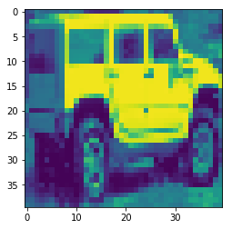
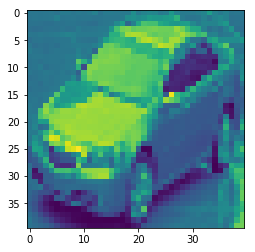
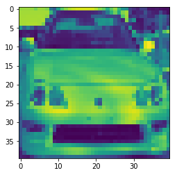
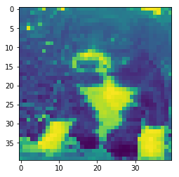

# Module 4 Final Project - Neural Networks
## Masood Qaim
## Data Science - Oct Cohort Full Time
## Instructor: Rafael Carrasco

For this project, I will attempt to build a model that can accuracy classify images. Here are the steps:
    - load the dataset 
    - preprocess
    - build the model
    - train, test, and tune the model
    - explain the model

## Step 1: Load the dataset


```python
#import libraries 
import pandas as pd #data stuff
import numpy as np #linear algebra
import matplotlib.pyplot as plt #preview image
import glob
%matplotlib inline
import os #iterate through directories 
import cv2 #image operation
import random
from sklearn.model_selection import train_test_split
from sklearn.preprocessing import LabelBinarizer
#from keras.preprocessing.image import img_to_array
```


```python
#loading the data set
datadir = r'C:\Users\Masood\Documents\FlatIron\module4\project\natural_images' #must put 'r' before string
categories = ['airplane', 'car', 'cat', 'dog', 'flower', 'fruit', 'motorbike', 'person']


def create_training_data(datadir, categories):
    training_data = []
    for category in categories:
        path = os.path.join(datadir, category) #our path to the images
        class_label = categories.index(category) #lables our data; car, cat, dog,...
        for img in os.listdir(path):
            img_array = cv2.imread(os.path.join(path, img), cv2.IMREAD_GRAYSCALE) #convert images to grayscale
            new_array = cv2.resize(img_array, (40, 40)) #resizing to 40x40 pixels so i can run/tune the model quickly 
            training_data.append([new_array, class_label])#this is where i made a mistake. i was passing img_array instead of new_array. that is why my img shape was not 128,128
    return training_data

training_data = create_training_data(datadir=datadir, categories=categories)

random.shuffle(training_data)
```


```python
#confirm all images have been saved
print('The number of images in our dataset:', len(training_data))
print('The type of data is:', type(training_data))
print('How an image appears numerically:')
print(training_data[1])

#convert our dataset into an array
training_data_array = np.asarray(training_data)
print(type(training_data_array))

print('The shape of the data is:', training_data_array.shape, 'the first column is the data, second is the label')
```

    The number of images in our dataset: 6899
    The type of data is: <class 'list'>
    How an image appears numerically:
    [array([[128, 125, 120, ..., 126, 116, 103],
           [112,  72,  61, ..., 118, 117, 110],
           [132,  59,  69, ..., 133, 121, 105],
           ...,
           [152, 151, 146, ...,  52,  58,  58],
           [110, 104, 100, ..., 105,  98,  93],
           [ 77,  83,  87, ..., 106, 103, 105]], dtype=uint8), 0]
    <class 'numpy.ndarray'>
    The shape of the data is: (6899, 2) the first column is the data, second is the label
    


```python
#seeing if lables are working
for lab_cat in training_data[:5]:
    print(lab_cat[1]) #index 0 is our data, index 1 is the label 
```

    4
    0
    7
    4
    5
    

## Step 2: Preprocessing the data

Neural Networks will learn whatever data your run it though, so preprocessig is very important. If your data is not formatted or labeled correctly, it will learn incorrect features. The data should also be normalized so it does not crash the kernal.

Few notes about the shape:

    The input_shape of your first layer (in my case, the conv layer) has to be 3D:
        input_shape = (img_height, img_width, channel). channel meaning the depth, 3 for RBB, 1 for gray
        ex. input_shape = (128, 128, 1)
        
    X_train shape should match the following:
        (batch_size, img_height, img_width, channel)
        ex. (1000, 128, 128, 1)


```python
X = [] # feature set
y = [] # lables

for features, label in training_data:
    X.append(features) #must be a numpy array
    y.append(label) #can be a list, but array is better
    
X = np.array(X)
X = X/255. #normalizing the data to read between 0-1

y = np.array(y)
mlb = LabelBinarizer() #a type of one hot encoding
y = mlb.fit_transform(y)
```


```python
X = X.reshape((-1, 40, 40))

#confirm X is between 0-1, shape is 40,40, X[3] is motocycle, y[6] is [0 1 0 0 0 0 0 0]
test_i = 6
plt.imshow(X[test_i])
print(X[test_i])
print('The shape of the images is: ', X[test_i].shape)
print(y[test_i])
```

    [[0.21568627 0.26666667 0.38039216 ... 0.3254902  0.34509804 0.34117647]
     [0.18823529 0.17647059 0.39215686 ... 0.41176471 0.40392157 0.29411765]
     [0.19215686 0.54509804 0.61176471 ... 0.38039216 0.38823529 0.30196078]
     ...
     [0.21568627 0.23137255 0.15294118 ... 0.58431373 0.48235294 0.50196078]
     [0.28235294 0.29803922 0.21960784 ... 0.55294118 0.54117647 0.49019608]
     [0.35294118 0.32156863 0.28235294 ... 0.54117647 0.44313725 0.44313725]]
    The shape of the images is:  (40, 40)
    [0 1 0 0 0 0 0 0]
    





```python
X = np.expand_dims(X, axis=4) #add an extra dimention so it can run through my model
```

    C:\Users\Masood\Anaconda3\lib\site-packages\ipykernel_launcher.py:1: DeprecationWarning: Both axis > a.ndim and axis < -a.ndim - 1 are deprecated and will raise an AxisError in the future.
      """Entry point for launching an IPython kernel.
    


```python
#confirm correct shape before passing the data through the model
X_train, X_test, y_train, y_test = train_test_split(X, y, test_size=0.1, random_state=42)

print(X_train.shape)
print(X_test.shape)
```

    (6209, 40, 40, 1)
    (690, 40, 40, 1)
    

## Step 3: Building the Model


```python
import tensorflow as tf
from keras.models import Sequential
from keras.layers import Dense, Dropout, Activation, Flatten, Conv2D, MaxPooling2D
```

    Using TensorFlow backend.
    


```python
model = Sequential()

model.add(Conv2D(64, (3,3), input_shape = (40, 40, 1)))
model.add(Activation('relu'))

model.add(MaxPooling2D(pool_size = (2,2)))
model.add(Dropout(0.25))

model.add(Flatten())
model.add(Dense(1024))
model.add(Activation('relu'))
model.add(Dropout(0.5))

model.add(Dense(8))
model.add(Activation('softmax'))

model.compile(loss='categorical_crossentropy',
             optimizer='adam',
             metrics=['accuracy'])

model.summary()
```

    _________________________________________________________________
    Layer (type)                 Output Shape              Param #   
    =================================================================
    conv2d_1 (Conv2D)            (None, 38, 38, 64)        640       
    _________________________________________________________________
    activation_1 (Activation)    (None, 38, 38, 64)        0         
    _________________________________________________________________
    max_pooling2d_1 (MaxPooling2 (None, 19, 19, 64)        0         
    _________________________________________________________________
    dropout_1 (Dropout)          (None, 19, 19, 64)        0         
    _________________________________________________________________
    flatten_1 (Flatten)          (None, 23104)             0         
    _________________________________________________________________
    dense_1 (Dense)              (None, 1024)              23659520  
    _________________________________________________________________
    activation_2 (Activation)    (None, 1024)              0         
    _________________________________________________________________
    dropout_2 (Dropout)          (None, 1024)              0         
    _________________________________________________________________
    dense_2 (Dense)              (None, 8)                 8200      
    _________________________________________________________________
    activation_3 (Activation)    (None, 8)                 0         
    =================================================================
    Total params: 23,668,360
    Trainable params: 23,668,360
    Non-trainable params: 0
    _________________________________________________________________
    

## Step 4: Train, Test, and Tune the Model

## The is first attempt of the model


```python
model.fit(X_train, y_train,
          batch_size=32,
          epochs=3,
          validation_split=0.3) #note, i removed X_train, y_train and just passe X, y because of validation split
```

    Train on 4346 samples, validate on 1863 samples
    Epoch 1/3
    4346/4346 [==============================] - 115s 26ms/step - loss: 0.9879 - acc: 0.6636 - val_loss: 0.5065 - val_acc: 0.8298
    Epoch 2/3
    4346/4346 [==============================] - 111s 26ms/step - loss: 0.4481 - acc: 0.8373 - val_loss: 0.4857 - val_acc: 0.8148
    Epoch 3/3
    4346/4346 [==============================] - 110s 25ms/step - loss: 0.3344 - acc: 0.8774 - val_loss: 0.4214 - val_acc: 0.8363
    


    <keras.callbacks.History at 0x1d24ddbdfd0>


- First attempt at my model yeiled a 86% accuracy and a loss of 0.37.
- The accuracy loss is 85% and validation loss is 0.41.
- you should expect your accuracy loss to be slightly lower and your validation loss to be slightly higher

## Fine Tuning my Model

- To improve my model, I will use TensorBoard to fine tune the paramaters
- Each model will have a unique name 


```python
from keras.callbacks import TensorBoard
import time
```

To fine tune my model, I need to run multiple networks with different parameters. First I'll create the model conditions, then run the data.


```python
#for each model, try a number from each side
dense_nums = [512, 1024, 2048]
dense_layers = [0, 1, 2]
layer_sizes = [32, 64, 128]
conv_layers = [1, 2, 3]

#for i in list(dense_layers[1:]):
    #print(i)

#test the for loop to make sure the correct models run
for dense_num in dense_nums:
    for dense_layer in dense_layers:
        for layer_size in layer_sizes:
            for conv_layer in conv_layers:
                NAME1 = '{}-conv-{}-nodes-{}-dense-{}'.format(conv_layer, layer_size, dense_layer, int(time.time()))
                print(NAME1)
```

    1-conv-32-nodes-0-dense-1550001366
    2-conv-32-nodes-0-dense-1550001366
    3-conv-32-nodes-0-dense-1550001366
    1-conv-64-nodes-0-dense-1550001366
    2-conv-64-nodes-0-dense-1550001366
    3-conv-64-nodes-0-dense-1550001366
    1-conv-128-nodes-0-dense-1550001366
    2-conv-128-nodes-0-dense-1550001366
    3-conv-128-nodes-0-dense-1550001366
    1-conv-32-nodes-1-dense-1550001366
    2-conv-32-nodes-1-dense-1550001366
    3-conv-32-nodes-1-dense-1550001366
    1-conv-64-nodes-1-dense-1550001366
    2-conv-64-nodes-1-dense-1550001366
    3-conv-64-nodes-1-dense-1550001366
    1-conv-128-nodes-1-dense-1550001366
    2-conv-128-nodes-1-dense-1550001366
    3-conv-128-nodes-1-dense-1550001366
    1-conv-32-nodes-2-dense-1550001366
    2-conv-32-nodes-2-dense-1550001366
    3-conv-32-nodes-2-dense-1550001366
    1-conv-64-nodes-2-dense-1550001366
    2-conv-64-nodes-2-dense-1550001366
    3-conv-64-nodes-2-dense-1550001366
    1-conv-128-nodes-2-dense-1550001366
    2-conv-128-nodes-2-dense-1550001366
    3-conv-128-nodes-2-dense-1550001366
    1-conv-32-nodes-0-dense-1550001366
    2-conv-32-nodes-0-dense-1550001366
    3-conv-32-nodes-0-dense-1550001366
    1-conv-64-nodes-0-dense-1550001366
    2-conv-64-nodes-0-dense-1550001366
    3-conv-64-nodes-0-dense-1550001366
    1-conv-128-nodes-0-dense-1550001366
    2-conv-128-nodes-0-dense-1550001366
    3-conv-128-nodes-0-dense-1550001366
    1-conv-32-nodes-1-dense-1550001366
    2-conv-32-nodes-1-dense-1550001366
    3-conv-32-nodes-1-dense-1550001366
    1-conv-64-nodes-1-dense-1550001366
    2-conv-64-nodes-1-dense-1550001366
    3-conv-64-nodes-1-dense-1550001366
    1-conv-128-nodes-1-dense-1550001366
    2-conv-128-nodes-1-dense-1550001366
    3-conv-128-nodes-1-dense-1550001366
    1-conv-32-nodes-2-dense-1550001366
    2-conv-32-nodes-2-dense-1550001366
    3-conv-32-nodes-2-dense-1550001366
    1-conv-64-nodes-2-dense-1550001366
    2-conv-64-nodes-2-dense-1550001366
    3-conv-64-nodes-2-dense-1550001366
    1-conv-128-nodes-2-dense-1550001366
    2-conv-128-nodes-2-dense-1550001366
    3-conv-128-nodes-2-dense-1550001366
    1-conv-32-nodes-0-dense-1550001366
    2-conv-32-nodes-0-dense-1550001366
    3-conv-32-nodes-0-dense-1550001366
    1-conv-64-nodes-0-dense-1550001366
    2-conv-64-nodes-0-dense-1550001366
    3-conv-64-nodes-0-dense-1550001366
    1-conv-128-nodes-0-dense-1550001366
    2-conv-128-nodes-0-dense-1550001366
    3-conv-128-nodes-0-dense-1550001366
    1-conv-32-nodes-1-dense-1550001366
    2-conv-32-nodes-1-dense-1550001366
    3-conv-32-nodes-1-dense-1550001366
    1-conv-64-nodes-1-dense-1550001366
    2-conv-64-nodes-1-dense-1550001366
    3-conv-64-nodes-1-dense-1550001366
    1-conv-128-nodes-1-dense-1550001366
    2-conv-128-nodes-1-dense-1550001366
    3-conv-128-nodes-1-dense-1550001366
    1-conv-32-nodes-2-dense-1550001366
    2-conv-32-nodes-2-dense-1550001366
    3-conv-32-nodes-2-dense-1550001366
    1-conv-64-nodes-2-dense-1550001366
    2-conv-64-nodes-2-dense-1550001366
    3-conv-64-nodes-2-dense-1550001366
    1-conv-128-nodes-2-dense-1550001366
    2-conv-128-nodes-2-dense-1550001366
    3-conv-128-nodes-2-dense-1550001366
    


```python
# WARNING: THIS WILL TAKE OVER 5 HOURS TO RUN!!!!!!
#create a for loop for the conv, size of layer, and dense layer
for dense_num in dense_nums:
    for dense_layer in dense_layers:
        for layer_size in layer_sizes:
            for conv_layer in conv_layers:
                NAME = '{}-conv-{}-nodes-{}-dense-{}'.format(conv_layer, layer_size, dense_layer, int(time.time()))
                tensorboard = TensorBoard(log_dir='log/{}'.format(NAME))
                model = Sequential()

                model.add(Conv2D(layer_size, (3,3), input_shape = (40, 40, 1)))
                model.add(Activation('relu'))
                model.add(MaxPooling2D(pool_size = (2,2)))

                for l in list(conv_layers):
                    model.add(Conv2D(layer_size, (3,3)))
                    model.add(Activation('relu'))
                    model.add(MaxPooling2D(pool_size = (2,2)))

                model.add(Flatten())
                for l in list(dense_layers[1:]):
                    model.add(Dense(dense_num))
                    model.add(Activation('relu'))

                model.add(Dense(8))
                model.add(Activation('softmax'))

                model.compile(loss='categorical_crossentropy',
                             optimizer='adam',
                             metrics=['accuracy'])

                model.fit(X_train, y_train,
                          batch_size=32,
                          epochs=2,
                          validation_split=0.3,
                          callbacks=[tensorboard])
```

## Explain the Final Model

After crashing the kernal several times (need a new computer with more gpu, ram, and a better cpu), the best model is 2-conv-128-nodes-2-dense-1549925617 model. From tensorboard's graphs, this model had the lowest validation loss while maintaining a high accuracy.


```python
#keras library import for Saving and loading model and weights
from keras.models import model_from_json
from keras.models import load_model
```


```python
#serialize model to JSON
#the keras model which is trained is defined as 'model' in this example
model_json_1 = model.to_json()

with open("model_num.json", "w") as json_file:
    json_file.write(model_json_1)

#serialize weights to HDF5
model.save_weights("model_num.h5")
```

## Prediction Test

To test if my network model can actually predict images, I'll define a function to run against my model.


```python
prediction = model.predict([X_test])
```


```python
#0: airplane
#1: car
#2: cat
#3: dog
#4: flower
#5: fruit
#6: motorbike
#7: person

def print_prediction(predictions=prediction, j = None):
    if j is None:
        return "No image selected"
    classes = dict(zip(range(8), ["airplane", "car", "cat", "dog", "flower", "fruit", "motorbike", "person"]))
    classes

    img_lab = np.argmax(prediction[j])
    print(classes[img_lab])

    predic_img = X_test.squeeze()
    plt.imshow(predic_img[j]);
    return None

print_prediction(j=500)
```

    car
    





```python
print_prediction(j = 600)
```

    car
    





```python
print_prediction(j=250)
```

    dog
    





Looks like my network model works.


```python
!jupyter nbconvert --to markdown Choropleth_map.ipynb
!mv Choropleth_map.md README.md
```
# classifying_images
